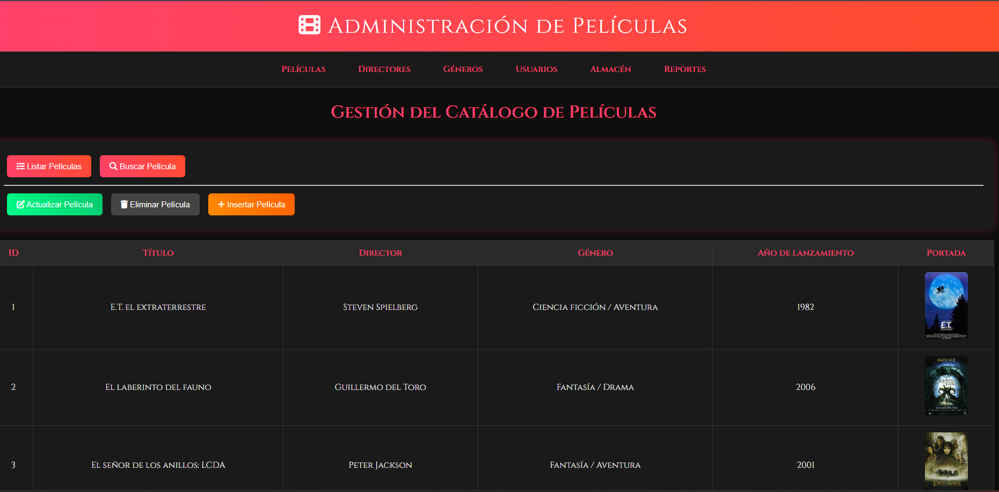

# AdministradorDePeliculas_Java-SpringBoot

Movie Manager es una aplicación web diseñada para la gestión de películas en un entorno seguro y escalable. 

El proyecto implementa un backend robusto con Java Spring Boot, emplea Hibernate para el mapeo objeto-relacional y utiliza Spring Security para garantizar autenticación y autorización de usuarios.

Características principales:

• 	📂 CRUD completo de películas: creación, edición, eliminación y consulta.

• 	🔐 Gestión de usuarios y roles con Spring Security (administrador / usuario).

• 	🗄️ Persistencia de datos mediante Hibernate y base de datos relacional.

• 	⚡ Arquitectura modular que facilita la escalabilidad y el mantenimiento.

• 	🌐 API RESTful lista para integrarse con frontend o aplicaciones móviles.

Tecnologías utilizadas:

• 	Java 21

• 	Spring Boot

• 	Spring Security

• 	Hibernate / JPA

• 	Maven

• 	Base de datos relacional (MySQL/PostgreSQL)

Objetivo del proyecto:
Este administrador de películas busca demostrar buenas prácticas en el desarrollo backend con Java, incluyendo seguridad, persistencia y diseño limpio. Es un proyecto pensado para servir como base en aplicaciones más complejas, integrando autenticación, autorización y gestión de datos de manera profesional.

